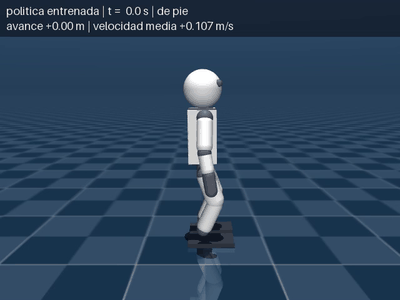
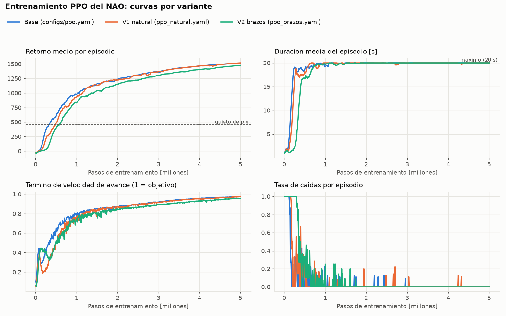

# Caminata con Reinforcement Learning para NAO V6 (MuJoCo + PPO)

Política de locomoción para el robot humanoide **NAO**, entrenada con **PPO** (Stable-Baselines3) en
simulación **MuJoCo**. El robot aprende desde cero a caminar hacia adelante; no hay trayectorias
articulares programadas a mano.



**Resultado de la política entregada** (`checkpoints/best_model.zip`, evaluada en 20 episodios con semillas fijas):

| Distancia en 20 s | Velocidad media | Caídas | Doble apoyo | Desviación lateral | Inclinación máx. del torso |
|---|---|---|---|---|---|
| **4.00 m** | **0.200 m/s** (objetivo 0.2) | **0 %** | 20 % del tiempo | 5 cm | 3.5° |

Entrenada en **~22 min en CPU** (5M pasos). Camina alternando los pies con una fase de doble apoyo,
como una marcha humana, y **balancea los brazos en oposición a las piernas**, un comportamiento que la
política descubrió sola. Detalles y comparación de variantes en la [sección 6](#6-experimentos-y-resultados).

---

## Contenido

1. [Instalación](#1-instalación)
2. [Demo rápida (sin entrenar)](#2-demo-rápida-sin-entrenar)
3. [Entrenamiento](#3-entrenamiento)
4. [Evaluación y evidencia](#4-evaluación-y-evidencia)
5. [Diseño del problema de RL](#5-diseño-del-problema-de-rl)
6. [Experimentos y resultados](#6-experimentos-y-resultados)
7. [Estructura del repositorio](#7-estructura-del-repositorio)
8. [Reproducibilidad](#8-reproducibilidad)
9. [Limitaciones y siguientes pasos](#9-limitaciones-y-siguientes-pasos)
10. [Modelo del robot, créditos y licencias](#10-modelo-del-robot-créditos-y-licencias)

---

## 1. Instalación

**Requisitos:** Python **3.12** y Git. No se necesita GPU: todo corre en CPU.
Probado en Windows 11 (Ryzen 7 5800H, 14 GB de RAM utilizable). Las dependencias también funcionan en Linux y macOS.

### Opción A: con [uv](https://docs.astral.sh/uv/) (recomendada)

```bash
git clone https://github.com/CamiloGomezB/NAO.git
cd NAO
uv sync
```

`uv sync` crea el entorno virtual `.venv` con las versiones exactas de `uv.lock`.
Todos los comandos siguientes se ejecutan con el prefijo `uv run`.

### Opción B: con pip

```bash
git clone https://github.com/CamiloGomezB/NAO.git
cd NAO
python -m venv .venv
# Windows:      .venv\Scripts\activate
# Linux/macOS:  source .venv/bin/activate
pip install -r requirements.txt
```

Con pip, omite el prefijo `uv run` en los comandos de abajo.

> **Windows y rutas largas:** si pip falla con `OSError ... Windows Long Path support`, clona el
> repositorio en una ruta corta (por ejemplo `C:\NAO`) o
> [habilita las rutas largas](https://pip.pypa.io/warnings/enable-long-paths). Algunos archivos de
> PyTorch superan el límite de 260 caracteres de Windows. `uv` (opción A) no tiene este problema.

### Versiones principales

| Paquete | Versión |
|---|---|
| Python | 3.12 |
| MuJoCo | 3.14.0 |
| Gymnasium | 1.3.0 |
| Stable-Baselines3 | 2.9.0 |
| PyTorch | 2.14.0 (CPU) |

Todas las dependencias están fijadas en [`pyproject.toml`](pyproject.toml), [`uv.lock`](uv.lock) y [`requirements.txt`](requirements.txt).

### Verificar la instalación

```bash
uv run python scripts/inspect_model.py
```

Debe terminar con `OK: el modelo carga y pasa las verificaciones basicas.`

---

## 2. Demo rápida (sin entrenar)

El repositorio incluye la política entrenada en [`checkpoints/`](checkpoints/). Para ver al NAO caminando
en el visor 3D de MuJoCo:

```bash
uv run python -m src.evaluate --model checkpoints/best_model.zip --episodes 2 --render
```

Para grabar un video en lugar de abrir el visor:

```bash
uv run python -m src.evaluate --model checkpoints/best_model.zip --episodes 1 --video videos/demo.mp4
```

> Controles del visor: clic izquierdo + arrastrar = rotar, clic derecho = desplazar, rueda = zoom.
> La ventana se cierra sola al terminar los episodios.

**Demo interactiva (parar y reanudar):**

```bash
uv run python scripts/demo_interactive.py
```

**Espacio** detiene o reanuda la caminata y **Enter** reinicia. La política se entrenó para caminar
siempre hacia adelante y no tiene una orden de "parar". Para detenerse, el script espera a que ambos
pies estén en el suelo (~60 ms) y congela la postura en ese instante. Tras reanudar, una nueva parada se
aplaza hasta llevar 2 s caminando, porque parar y reanudar muy seguido desestabiliza la marcha. Con
pulsaciones rápidas simuladas: **399/400 paradas sin caída**. Otras estrategias (volver a la pose de pie,
frenar gradualmente o acomodarse hacia la pose de pie una vez detenido) hacían caer al robot en un
40–100% de los casos. Una parada que junte los pies requeriría entrenar a la política con una orden
de velocidad (ver siguientes pasos).

---

## 3. Entrenamiento

```bash
uv run python -m src.train --config configs/ppo.yaml --total-timesteps 5000000 --run-name mi_entrenamiento
```

- Todos los hiperparámetros, la semilla y los parámetros del entorno están en [`configs/ppo.yaml`](configs/ppo.yaml).
- La salida queda en `runs/<run-name>/`: la configuración usada, versiones y commit, checkpoints
  periódicos, `best_model.zip`, `final_model.zip` y logs de TensorBoard.
- **Duración de referencia:** 5M pasos en **~22 min** (Ryzen 7 5800H, 16 entornos en paralelo, ~3,800 pasos/s).
  Con `--n-envs` se ajusta el número de procesos si el equipo tiene menos núcleos.
- Se puede interrumpir con `Ctrl+C`: guarda el modelo actual antes de salir.

Las variantes comparadas en la [sección 6](#6-experimentos-y-resultados) se entrenan igual, cambiando
`--config` por `configs/ppo_natural.yaml` o `configs/ppo_brazos.yaml`.

**Reproducir la política entregada** (V2 brazos) y copiarla a `checkpoints/`:

```bash
uv run python -m src.train --config configs/ppo_brazos.yaml --total-timesteps 5000000 --run-name ppo_brazos_5M
uv run python scripts/export_model.py --run ppo_brazos_5M
```

### Seguimiento con TensorBoard

```bash
uv run tensorboard --logdir runs
```

Abrir http://localhost:6006. Además de las métricas de PPO, se registra la media de **cada término
de la recompensa** (`reward_terms/*`) y la **tasa y motivo de caídas** (`episodes/*`).

---

## 4. Evaluación y evidencia

`src/evaluate.py` es independiente del entrenamiento. Carga un modelo, junto con la normalización de
observaciones y la configuración del entorno que se detectan automáticamente, y lo evalúa en N
episodios con semillas fijas:

```bash
uv run python -m src.evaluate --model checkpoints/best_model.zip --episodes 20 --json results/metrics.json
```

Métricas por episodio y agregadas (media ± desviación estándar): distancia recorrida, velocidad media,
duración, tasa de caídas, retorno, desviación lateral, inclinación máxima del torso y esfuerzo
(media de Σ τ²).

**Evidencia incluida en el repositorio:**

| Archivo | Contenido |
|---|---|
| [`results/metrics.json`](results/metrics.json) | Evaluación de la política entregada en 20 episodios |
| [`results/comparison.md`](results/comparison.md) | Comparación de las variantes con las mismas métricas |
| [`results/training_curves.png`](results/training_curves.png) | Curvas de entrenamiento de las variantes |
| [`media/demo.gif`](media/demo.gif) | Demo de la política entregada (8 s) |
| [`media/demo.mp4`](media/demo.mp4) | Episodio completo de la política entregada (20 s) |

Para regenerarlos: `scripts/compare_runs.py` (comparación), `scripts/plot_training.py` (curvas) y
`scripts/make_gif.py` (GIF a partir del video). Los tres requieren los runs en `runs/`, es decir,
reentrenar.

---

## 5. Diseño del problema de RL

Entorno Gymnasium `NaoWalk-v0` en [`src/envs/nao_walk_env.py`](src/envs/nao_walk_env.py).

| Elemento | Diseño |
|---|---|
| **Frecuencia** | La política actúa a **50 Hz**; la física corre a 500 Hz (`timestep` = 2 ms) |
| **Acción** (10) | Desviación en [-1, 1] × escala, sumada a la pose de pie `home`, para HipRoll, HipPitch, KneePitch, AnklePitch y AnkleRoll de cada pierna. Servos PD (kp=30, kv=0.5) con los límites de torque del NAO |
| **Fijas** | HipYawPitch en 0 (inclina mucho el torso y no aporta a caminar recto); cabeza y brazos en `home` en la versión base |
| **Observación** (43) | Gravedad proyectada (inclinación, IMU), velocidad angular (giroscopio), velocidad lineal del torso, ángulos y velocidades de las 10 articulaciones, acción anterior, contacto de cada pie y un reloj de marcha (sin/cos de un ciclo de 0.6 s) |
| **Terminación** | Caída: torso < 0.22 m, inclinación > 40° o cualquier parte que no sea un pie tocando el suelo |
| **Truncamiento** | 1000 pasos (20 s) |
| **Política entregada (V2)** | Además controla **LShoulderPitch y RShoulderPitch** (±0.5 rad), lo que da 12 acciones y 49 observaciones; velocidad objetivo 0.2 m/s y cada pie apoya el 60% del ciclo de marcha (20% de doble apoyo). Ver [sección 6](#6-experimentos-y-resultados) |

**Recompensa por paso** (pesos en `REWARD_WEIGHTS`, configurables desde el YAML):

| Término | Peso | Propósito |
|---|---|---|
| Velocidad de avance: exp(−((vx − v_obj)/0.1)²), v_obj = 0.15 m/s (0.2 en V1 y V2) | +1.0 | Avanzar a la velocidad objetivo, sin premiar lanzarse |
| Patrón de marcha (contactos vs reloj) | +0.5 | Alternar los pies al ritmo del reloj (con 20% de doble apoyo en V1 y V2) |
| Vivo | +0.1 | Pequeño premio por no caer |
| Inclinación (gx² + gy²) | −2.0 | Torso erguido |
| Altura ((z − 0.31)²) | −50 | Sin agacharse ni gatear |
| Velocidad lateral (vy²) y giro (ωz²) | −10, −0.5 | Caminar recto |
| Cambio de acción (‖aₜ − aₜ₋₁‖²) | −0.02 | Movimientos suaves |
| Torque (Σ τ²) | −0.001 | Esfuerzo moderado |
| Caída | −10 | Evitar caerse |

**Algoritmo:** PPO de Stable-Baselines3, como recomienda el enunciado. Red 256×256 (ELU) para
política y valor, 16 entornos en paralelo, 8,192 pasos por actualización, normalización de
observaciones y recompensas (`VecNormalize`) y exploración inicial moderada (`log_std_init = −1`).

**Por qué este stack:** MuJoCo + PPO/SB3 es el stack recomendado. Se usa en CPU y en Windows nativo:
la alternativa en GPU (MJX/JAX) requiere WSL/Linux y complica la reproducibilidad, mientras que en CPU
cualquier persona puede instalar y ejecutar el proyecto con los mismos comandos.

---

## 6. Experimentos y resultados

Se entrenaron tres variantes con el mismo algoritmo, hiperparámetros, semilla (0) y presupuesto
(**5M pasos, ~22 min cada una**). Cada variante se diseñó a partir de lo observado en la anterior:

| Variante | Config | Cambios respecto a la anterior | Motivación |
|---|---|---|---|
| **Base** | [`ppo.yaml`](configs/ppo.yaml) | — | Primer diseño (sección 5) |
| **V1 natural** | [`ppo_natural.yaml`](configs/ppo_natural.yaml) | Cada pie apoya el 60% del ciclo (`stance_fraction: 0.6`, 20% de doble apoyo); velocidad objetivo 0.2 m/s | La base caminaba con "pasitos de soldado": nunca apoyaba ambos pies a la vez |
| **V2 brazos** ✅ | [`ppo_brazos.yaml`](configs/ppo_brazos.yaml) | La política también controla los hombros (`control_arms: true`, 12 acciones, 49 observaciones) | En V1 los brazos seguían rígidos |

**Evaluación** (20 episodios, semillas 1000–1019, acciones deterministas; media ± desviación estándar;
tabla completa en [`results/comparison.md`](results/comparison.md)):

| Variante | Caídas | Distancia [m] | Velocidad [m/s] | Desv. lateral [m] | Doble apoyo [%] | Altura pie izq./der. [cm] | Esfuerzo Σ τ² | Brazos |
|---|---|---|---|---|---|---|---|---|
| Base | 0 % | 3.02 ± 0.00 | 0.151 | −0.13 ± 0.02 | 0.2 | 4.1 / 2.5 | 12.8 | fijos |
| V1 natural | 0 % | 3.98 ± 0.00 | 0.199 | −0.04 ± 0.03 | 20.1 | 3.7 / 3.3 | 12.3 | fijos |
| **V2 brazos** | **0 %** | **4.00 ± 0.00** | **0.200** | +0.05 ± 0.03 | **20.0** | 3.7 / 4.1 | 14.3* | **se balancean** |

\* Incluye el esfuerzo de los motores de los hombros, que las otras variantes no usan.



**Observaciones:**

- **Las tres variantes caminan sin caerse** en los 20 episodios y alcanzan su velocidad objetivo con
  gran precisión. Las curvas muestran que el robot primero aprende a no caerse (~0.5M pasos) y
  después a avanzar.
- **V1 corrige la "marcha de soldado".** Permitir el doble apoyo en el reloj de marcha dio pasos más
  largos y fluidos (evaluación visual) y, sin buscarlo directamente, **simetría entre piernas**: altura de
  los pies 3.7/3.3 cm frente a 4.1/2.5 cm, y **3 veces menos desviación lateral**.
- **V2 aprende a balancear los brazos de forma natural.** El hombro izquierdo oscila ~46° y el
  derecho ~30°, **en fase con la pierna contraria** (correlación hombro izquierdo–cadera derecha
  = +0.85), igual que al caminar una persona. No hay ninguna recompensa que lo pida explícitamente.
  Aprende algo más lento (más articulaciones que coordinar), pero a los 5M pasos iguala a V1.

**Política entregada: V2 brazos.** Empata con V1 en todas las métricas de caminata (0% caídas,
0.200 m/s, 20% de doble apoyo, desviación lateral de ~5 cm) y es la única que resuelve también la rigidez
de los brazos. Su costo es un esfuerzo algo mayor, por los motores de los hombros. V1 queda como
alternativa igual de válida si se prefiere mantener los brazos quietos.

**Otros hallazgos del proceso:**

- **Reproducibilidad:** dos entrenamientos con la misma configuración y semilla dieron curvas y
  políticas idénticas, episodio por episodio.
- **Rendimiento en CPU (Windows):** 16 entornos en paralelo con **4 hilos de PyTorch** es la mejor
  configuración (~3,800 pasos/s de entrenamiento). Con 8 hilos, PyTorch compite con los procesos de
  simulación y el entrenamiento es ~35% más lento. El cuello de botella es la comunicación entre
  procesos, no la física (`scripts/benchmark_envs.py`).
- **Robustez observada:** en la demo en vivo, al reiniciar la simulación desde el visor (Backspace),
  que deja al robot en una pose neutra que nunca vio en el entrenamiento, la política se recupera y
  sigue caminando.
- **Ajuste por plazo:** el plan original ([`PLAN.md`](PLAN.md)) contemplaba un entrenamiento largo
  de la base. Como la base ya caminaba a los 5M pasos, ese tiempo se usó en las dos variantes, que
  atacan lo observado en ella.

---

## 7. Estructura del repositorio

```
NAO/
├── assets/nao/          # Modelo MuJoCo del NAO (nao.xml, scene.xml) y SOURCE.md (origen y licencias)
├── configs/             # Configuraciones de entrenamiento (base y variantes)
├── src/
│   ├── envs/            # NaoWalkEnv (Gymnasium) y registro de NaoWalk-v0
│   ├── utils/           # Entornos paralelos, callbacks de entrenamiento, video
│   ├── train.py         # Entrenamiento (CLI)
│   └── evaluate.py      # Evaluación, demo en vivo, video y métricas (CLI)
├── scripts/             # Verificaciones y utilidades (ver tabla abajo)
├── checkpoints/         # Política entregada: modelo, normalización, config y metadatos
├── results/             # Métricas, comparación y curvas de entrenamiento
├── media/               # GIF de la demo
├── PLAN.md              # Plan de trabajo paso a paso del sprint
└── pyproject.toml / uv.lock / requirements.txt
```

**Scripts de verificación.** Cada uno termina en `RESULTADO: OK` o `FALLA`:

| Script | Qué verifica |
|---|---|
| `scripts/inspect_model.py` | Carga del modelo, masas (5.305 kg), articulaciones y actuadores |
| `scripts/check_contacts.py` | Contacto pie-suelo: penetración, rebote, deslizamiento |
| `scripts/check_standing.py` | Estabilidad de pie con los servos PD, con ruido y empujones |
| `scripts/joint_sweep.py` | Cada articulación recorre su rango, sin atravesar el cuerpo (genera video) |
| `scripts/check_env.py` | API de Gymnasium y SB3, semillas reproducibles |
| `scripts/inspect_obs.py` | Signos y marcos de referencia de las observaciones |
| `scripts/inspect_actions.py` | Mapeo acción → articulación y límites |
| `scripts/inspect_termination.py` | Detección de caída sin falsos positivos ni negativos |
| `scripts/inspect_reward.py` | La recompensa ordena correctamente los comportamientos |
| `scripts/benchmark_envs.py` | Velocidad con distintos números de entornos en paralelo |

Utilidades: `scripts/view_model.py` (visor interactivo del modelo; Enter reinicia),
`scripts/render_episode.py` (videos con políticas de prueba), `scripts/compare_runs.py` (tabla
comparativa de variantes), `scripts/plot_training.py` (gráficas), `scripts/make_gif.py` (GIF de la demo)
y `scripts/export_model.py` (copia un modelo de `runs/` a `checkpoints/`).

---

## 8. Reproducibilidad

- **Semillas:** cada entrenamiento usa la semilla de su YAML (`seed: 0`); el entorno `i` usa `seed + i`
  y la evaluación usa semillas fijas (1000, 1001…).
- **Determinismo verificado:** dos entrenamientos independientes con la misma configuración y semilla
  produjeron **exactamente** las mismas curvas y la misma política (mismas métricas episodio a episodio).
- **Trazabilidad:** cada run guarda `config.yaml` y `metadata.yaml` (commit de Git, versiones de
  Python, MuJoCo, Gymnasium, SB3 y PyTorch, y el comando ejecutado). Los de la política entregada están
  en `checkpoints/best_model_config.yaml` y `checkpoints/best_model_metadata.yaml`. Se entrenó con el
  commit `1bc49f6`; el código del entorno y del entrenamiento no cambió después, y los cambios
  posteriores son solo de evaluación y documentación.
- **Sin rutas absolutas:** todas las rutas se resuelven relativas a la raíz del repositorio.
- **Sin reentrenar:** la política final se incluye en `checkpoints/`, así que la demo funciona recién clonado.

---

## 9. Limitaciones y siguientes pasos

### Limitaciones

- **Solo simulación.** No se probó en el robot físico. La política no se entrenó con aleatorización de
  dinámica (masas, fricción, retrasos, ruido de sensores), así que no se espera que funcione
  directamente en el NAO real.
- **Modelo aproximado.** Es un NAO V5 con geometrías simplificadas; la dinámica de los servos reales
  (retrasos, límites de velocidad, calentamiento) no está modelada, solo un PD ideal con límites de torque.
- **Observación privilegiada.** La velocidad lineal del torso se lee directamente de la simulación;
  en el robot real habría que estimarla.
- **Tarea acotada.** Camina solo hacia adelante, en línea recta, a una velocidad fija (sin comandos
  de giro ni de velocidad), sobre suelo plano y sin perturbaciones.
- **Estilo de marcha.** La política base caminaba con pasos cortos, sin fase de doble apoyo ("marcha de
  soldado") y con los brazos fijos. Las variantes V1 y V2 de la sección 6 corrigieron estos puntos, pero
  la marcha sigue siendo de pasos cortos (~4 cm de altura de pie).
- **Presupuesto de cómputo.** Cada variante se entrenó 5M pasos (~22 min en CPU) por el plazo del
  sprint; no hubo búsqueda de hiperparámetros ni varias semillas por variante.

- **Asimetrías residuales en la política entregada:** el balanceo de brazos no es simétrico (~46° vs
  ~30°) y un pie se levanta algo más que el otro (3.7 vs 4.1 cm). Cada variante se entrenó con una sola
  semilla, así que no se midió la variabilidad entre semillas.

### Siguientes pasos

1. **Robustez:** aleatorización de dominio (masas, fricción, ganancias PD, retraso de acciones),
   empujones durante el entrenamiento y terreno irregular.
2. **Comandos:** velocidad (incluida velocidad 0, para detenerse juntando los pies) y giro como entrada de la política, para caminar en cualquier dirección y parar de forma natural.
3. **Marcha más natural:** recompensas de altura de pie y longitud de paso, simetría entre piernas y
   balanceo de brazos coordinado.
4. **Hacia el robot real (sim-to-real):** modelar la dinámica de los servos del NAO (retrasos y límites
   de velocidad), quitar observaciones privilegiadas, ejecutar la política a través de NAOqi/LoLA y
   probar primero con el robot suspendido. Los ángulos ya usan la convención de NAOqi, lo que facilita
   este paso.
5. **Escala:** entrenar en GPU con MuJoCo MJX (miles de entornos en paralelo) para explorar más
   variantes y semillas.

---

## 10. Modelo del robot, créditos y licencias

- **Modelo MuJoCo del NAO:** derivado de
  [nico-bohlinger/one_policy_to_run_them_all](https://github.com/nico-bohlinger/one_policy_to_run_them_all)
  (MIT), con parámetros cinemáticos y dinámicos de [ros-naoqi/nao_robot](https://github.com/ros-naoqi/nao_robot)
  (BSD-3). Es un NAO **V5**: el V6 conserva la misma estructura mecánica, dimensiones y articulaciones.
- **Modificaciones:** geometrías simplificadas (sin las mallas de Aldebaran, que tienen licencia
  CC BY-NC-ND), sin dedos, HipYawPitch acoplado como en el robot real, ejes en la convención oficial de
  Aldebaran (NAOqi), autocolisiones y servos de posición. Detalle completo en
  [`assets/nao/SOURCE.md`](assets/nao/SOURCE.md).
- **Referencia:** N. Bohlinger et al., *One Policy to Run Them All: an End-to-end Learning Approach to
  Multi-Embodiment Locomotion*, CoRL 2024.
